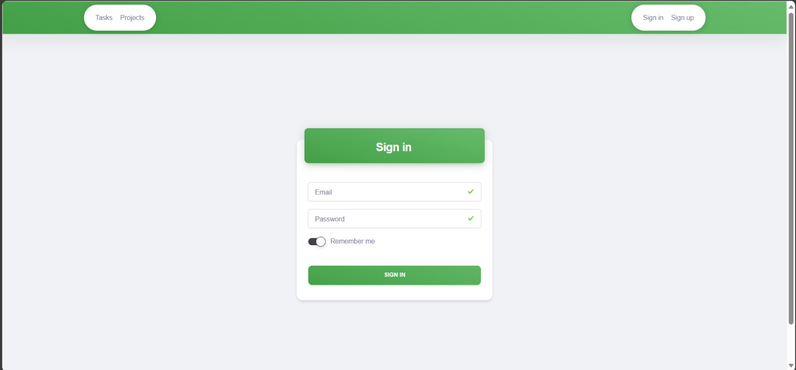

# :bug: TaskForge: Agile Project Manager

TaskForge is an intuitive Agile Project Manager built using ASP.NET Core, following the MVC design pattern and utilizing MS SQL Server as the primary database. It serves as a lightweight solution to effectively track and manage tasks and projects within a growing software development environment.



## Key Features

- **Task and Project Management:** Create, read, update, and delete tasks and projects effortlessly within an organized to-do list structure.
- **User Authentication:** Secure user login and registration system for maintaining privacy and confidentiality.
- **Flexible Task Status:** Monitor task progress with distinct status labels, including Open, Closed, and Completed.
- **Email Notifications:** Receive email notifications upon task completion for enhanced communication and accountability.

## How to Use

### Prerequisites

Ensure you have the following software installed:

- .NET 6 SDK

### Getting Started

1. Create an account or sign in if you already have one using the top right corner of the navbar.
2. Create your first project:
   - Navigate to the project tab and click on "Add Project".
   - Fill out the required forms and click "Create".
3. Access the Tasks tab to view all projects as cards. Click on "See Tasks" to create a new task for each project.
4. Fill out all required fields in the task creation form, and click "Create".

### Additional Functionality

- Delete projects by clicking the trash can icon in the projects tab or the delete button in the tasks tab.
- View detailed information about each task by clicking the info button at the end of each row in the task tab.

## Dependencies

- .NET 6 SDK

## Building and Running

### Local Environment

1. Navigate to the project directory.
2. Execute the following commands in the terminal:

```bash
dotnet restore
dotnet build
dotnet run
```

## Creating the Database

This will need to be perfored before running the application for the first time

1. Change to the Persistence directory (i.e. `bugTracker.Core/bugTracker.Core.Persistence`)

    `cd bugTracker.Core.Persistence`

1. Issue the Entity Framework command to update the database

    `dotnet ef database update`

    This will ensure that all migrations are used to create or alter the local database instance


### Requirements
| #  | Requirement                                          | Implementation details                                                                                                                                    |    Implemented?    |
|--- |------------------------------------------------------|-----------------------------------------------------------------------------------------------------------------------------------------------------------|:------------------:|
| 1  | Dependency injection                                 | Used the built-in ASP.NET Core dependency container.                                                                                                      | :heavy_check_mark: |
| 2  | Working with the database (CRUD, Repository pattern) | Used the **MySQL** relational DBMS. CRUD operations on database objects are implemented. **Repository pattern** was also implemented.                     | :heavy_check_mark: |
| 3  | Data mapping                                         | **Entity Framework Core** was used as an ORM.                                                                                                             | :heavy_check_mark: |
| 4  | Data validation                                      | Annotations from `System.ComponentModel.DataAnnotations` were used to validate the model. Own custom validation attributes were also used.                | :heavy_check_mark: |
| 5  | Logging                                              | Used the logger `ILogger<T>` from `Microsoft.Extensions.Logging`. Filters were also used for logging SQL queries.                                         | :heavy_check_mark: |
| 6  | Testing                                              | Unit tests for `BugTracker` are implemented using the **xUnit** testing framework. The isolation framework **Moq** was also used.                         | :heavy_check_mark: |          
| 7  | Integration with any HTTP service                    | Implemented integration with the public job service over HTTP via `HttpClient` from `System.Net.Http`. **Retry policy** was also implemented via `Polly`. | :heavy_check_mark: |
| 8  | Authentication                                       | Authentication is implemented using **Identity** and custom Razor pages.                                                                                  | :heavy_check_mark: |    
| 9  | Message queues                                       | A message queue using the **RabbitMQ** (AMQP protocol) was used to communicate with the microservice.                                                     | :heavy_check_mark: |   
| 10 | Microservices                                        | A mail (SMTP) microservice was implemented that notifies the user about assigment to the issue.                                                           | :heavy_check_mark: |
